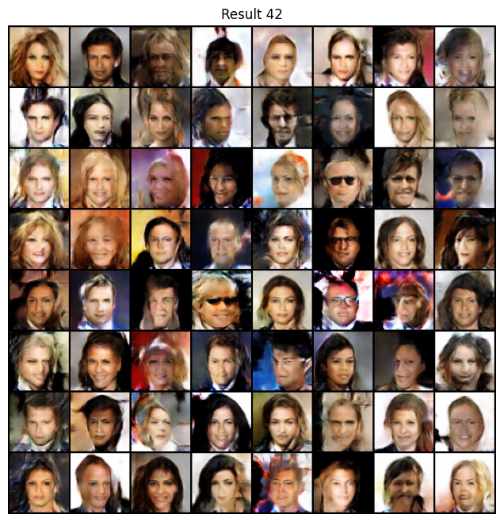
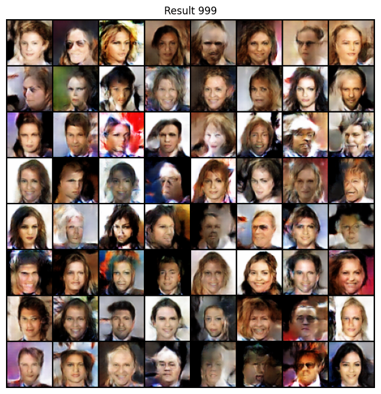
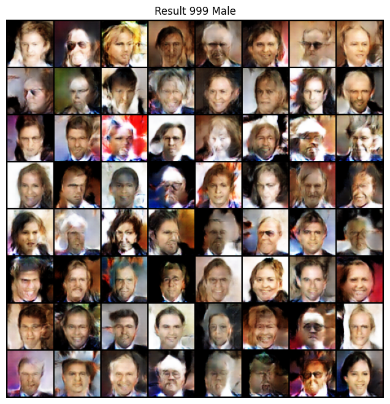

# HW3 Report

本次作业主要实现了：
- 给定种子，调用在Celeb-A上训练完成的DCGAN生成器网络，生成64张拼合的64*64的人像
- 基于噪声变量的图像编辑功能实现

以下分别进行简单总结。

## Seed Given, DCGAN Played

根据tutorial_dcgan.ipynb给出的网络结构调用即可。

相关代码在[utils.py](../utils.py)中实现。

## Image Editing Based on Noise Vector [extension]

设定随机数种子为42，生成64个正态分布的噪声输入，获得结果图像。

从中选出了性别特征较明显的一些噪声输入：  
男：[2, 11, 12, 21, 22, 26, 27, 29, 33, 62]  
女：[0, 4, 10, 15, 20, 24, 28, 36, 41, 45, 56, 58]  
据此计算编辑向量`va`。

设定随机数种子为999，同样生成64个正态分布的噪声输入，获得结果图像。

在其基础上，为其noise加上之前得到的编辑向量`va`，获得结果图像。

可以发现其中一些人脸发生了性别的转变，效果较好的例如：第四行第七个、第五行第七个、第七行第二个等。

相关代码在[editing.ipynb](../assets/hw3/editing.ipynb)中实现。