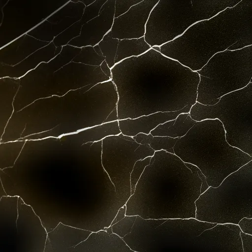
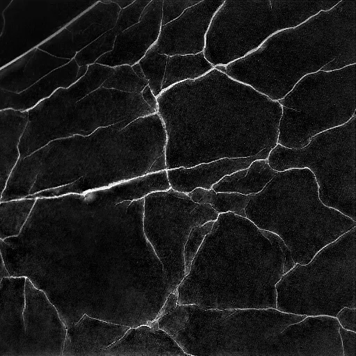
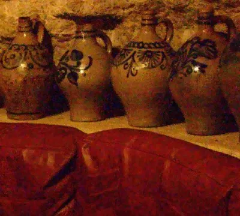

# HW4 Report

本次作业主要实现了：
- 手动实现了导向滤波和联合双向滤波
- 允许用户通过cv2调用上面两种方法

以下分别进行简单总结。

## Guided Filter

引导滤波的主要公式总结如下：
首先是对输出图像的假设，它与引导图像的值成线性关系，这能够保护图像的边缘和梯度。
```math
q_i=aI_i+b
```
在一个窗口 $w_k$ 中，利用最小二乘法可以得到估计值。
```math
a_k=\frac{\text{cov}_k(I,p)}{\text{var}_k(I)+\epsilon} \\ 
b_k=\bar{p_k}-a_k\bar{I_k}
```
在实际计算时，采用了快速计算 $a_k$ 方法
```math
a_k=\frac{A_k(Ip)-A_k(I)A_k(p)}{A_k(I^2)-A_k^2(I)+\epsilon}, 
```
其中， $A_k$ 代表对当前窗口内元素取均值。  
在输出图像中，一个像素会属于多个窗口，将所有的值取均值即可。
```math
q_i=\frac{1}{|w|}\sum_{i\in w_k}(a_kI_i+b_k)
```

代码使用暴力循环实现，但它的滤波核尺寸可以比较大，因为内部是使用`np.mean()`完成优化，而不像下面的双向滤波是暴力循环的。`filter_size=32, epsilon=0.01`的结果如下，可以看到原先较粗的裂缝softmask向裂缝收缩。  
[输入图像](../assets/test_image/soft_mask.png)和[引导图像](../assets/test_image/crack.png)见此。  


与此对比的，调用`cv2.ximgproc.guidedFilter`方法，使用相同参数，结果如下。不知道为什么我的实现在裂缝周围颜色出现了色偏……  


## Joint Bilateral Filter [extension]

首先定义一个general linear translation-variant滤波过程，它涉及引导图像 $I$ ，输入图像 $p$ ，输出图像 $q$ ，滤波核。其中输出图像在像素 $i$ 的值被定义为
```math
q_i=\sum_j{W_{ij}}(I)p_j, 
```
而联合双向滤波的滤波核被定义为
```math
W_{ij}^{bf}(I)=\frac{1}{K_i}\exp(-\frac{|x_i-x_j|^2}{\sigma_s^2})\exp(-\frac{|I_i-I_j|^2}{\sigma_r^2}), 
```
其中， $\sigma_s$ 控制位置的影响， $\sigma_r$ 控制灰度的影响， $K_i$ 是归一化系数。

代码使用暴力循环实现，导致速度很慢，滤波核尺寸为5时需要60秒左右。`filter_size=5, sigma_s=4, sigma_r=0.2`的结果如下，可以看到噪点被一定程度去除了。  
[输入图像](../assets/test_image/a.jpg)和[引导图像](../assets/test_image/b.jpg)见此。  



为了实现更完美的去噪效果，通常滤波核尺寸需要很大。调用`cv2.ximgproc.jointBilateralFilter`方法，设置`d=5, sigmaColor=16, sigmaSpace=10`结果如下。但对于我的暴力循环实现来说，运行所需时间是不可接受的。  

