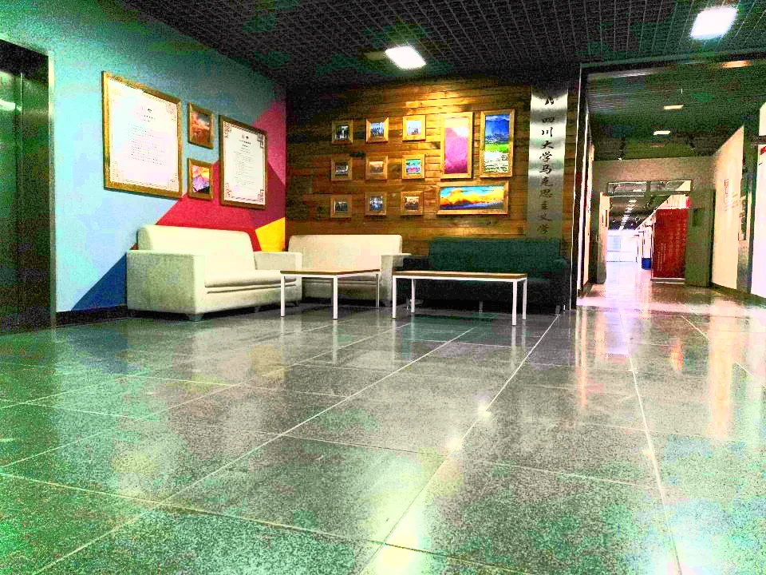
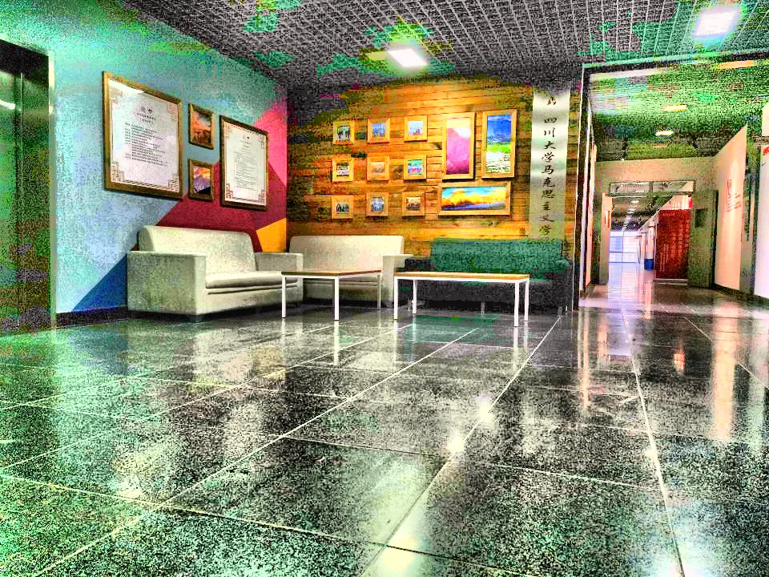

# HW5 Report

本次作业主要实现了：
- 彩色图直方图均衡化（HE）
- 彩色图限制对比度自适应直方图均衡化（CLAHE）

以下分别进行简单总结。

## HE

允许用户输入一张彩色图片，对其完成（无条件的）直方图均衡化，步骤如下：
- 将图像转到HSL空间（使用[hw1](hw1.md)完成的`RGB2HSL`方法），对L通道进行直方图均衡化
- L通道取值为 $[0,1]$ ，将其扩大255倍后取整，得到256个等级。分别计数后求密度分布函数
- 递归地求累积分布函数，它取值在 $[0,1]$ ，因此可以直接作为映射的结果，对原L通道扩大255倍取整后通过下标赋值
- 线性增大饱和度（0.02）
- 将图像转回RGB空间

使用[低光照图像](../assets/test_image/2039.jpg)进行测试，结果如下：  

## CLAHE

允许用户输入一张彩色图片和两个参数：`Clip Limit`和`Grid Size`，前者指示对比度限制值，后者指示将图像分割成块的数量。
- 将图像转到HSL空间，对L通道进行CLAHE
- 首先完成对图像的分块，存储横、纵网格的起点坐标和中心坐标
- 对每个网格进行CLHE操作
    - 用一个 $[grid\_size[0], grid\_size[1], 256]$ 形状的矩阵分别存储每个网格内部的映射关系
    - 将频数超出 $clip\_limit * (size\ of\ grid) / 255$ 的取值平均分配给256个等级，除不尽的部分从0等级开始每个等级分配1即可
    - 进行HE操作
- 对像素进行插值
    - 维护`blockx`和`blocky`指示当前像素处于哪一个分块中
    - 角落处的1/4方块使用本块的映射函数，上下左右的1/2横条使用相邻两块的映射函数线性插值，中部的使用相邻四块的映射函数双线性插值。这里就用到了之前存储的横纵网格的起点坐标和中心坐标
- 线性增大饱和度（0.02）
- 将图像转回RGB空间

使用同样的[低光照图像](../assets/test_image/2039.jpg)测试，参数为`Clip Limit=40, Grid Size=(8, 8)`结果如下：  
  
主要注意走廊尽头的窗户在HE操作下出现了过曝，而在CLAHE中得到了较好的细节。