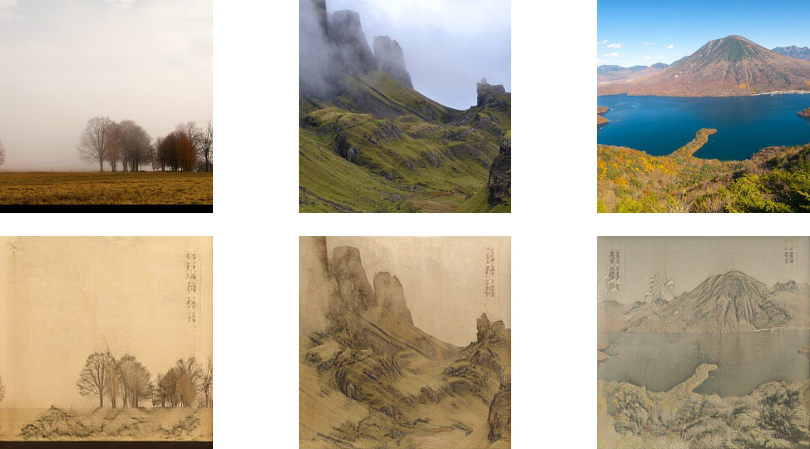
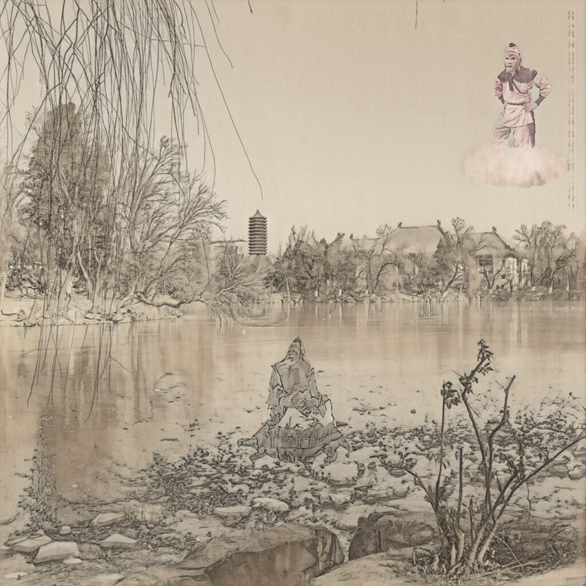

## 图像处理大作业报告

### 图像国画风格化

首先，我训练了一个网络完成真实照片图像与传统国画的相互转化。

网络结构部分，我采用了[CycleGAN-Turbo](https://github.com/GaParmar/img2img-turbo)，其主要结构如下图所示：

转换网络主要由Encoder、U-Net、Decoder三部分组成，都是使用了预训练的sd-turbo网络参数，除进入U-Net的第一层是全新训练的之外，其它都只使用LoRA进行微调。在Encoder和Decoder的对应层之间添加Zero Conv卷积层，用于维护图像细节完整。
注意到我们的网络是双向工作的，区别仅在于给Text Encoder提供的prompt不同。在此对国画风格提供的prompt是 *Traditional Chinese ink painting featuring beautiful landscape* ，对真实风格图像提供的prompt是 *Real world photo featuring beautiful landscape*。
在此基础上，网络还使用了额外的判断器判断生成图真实性，两个方向的判断器分别训练，均基于ViT-B-32模型。
基于此，网络的损失函数可以写成如下形式：
三者分别为：循环重建损失、GAN判断器损失和相同域的重建损失，最终损失函数为三者的加权和。

CycleGAN-Turbo的好处在于不要求成对的训练数据，因此，真实图像和国画风格图像可以分别收集。我在网络上搜索到了相关的数据集，其内容都以山水风景为主，在语义层面的分歧不会太大，适合训练使用。
真实风景图像数据集来自[Landscape Pictures](https://www.kaggle.com/datasets/arnaud58/landscape-pictures)，选取了前2200张图像，其中2000张为训练数据，200张作为测试数据。
国画风景图像数据集来自[Traditional Chinese Landscape Painting Dataset](https://github.com/alicex2020/Chinese-Landscape-Painting-Dataset)，包含从美国博物馆收集的2192张图像，选择其中2003张为训练数据，189张作为测试数据。

所有图像均被缩小为256*256，在一张NVIDIA GeForce RTX 4090上训练了17.5h，得到了最终的模型。

模型测试结果如下图所示，上面一行为给模型提供的真实图像，下面一行为模型输出的国画风格图像。

可以看到，网络在较好地完成国画纹理渲染的基础上与原图语义高度符合，较好地完成了目标任务。

将此网络运用于我在未名湖边拍摄的风景图像，效果如下所示：

从左上到右下，依次为：原图（1024*1024），输出图，缩小至256\*256后通过模型再上采样至1024\*1024输出图，缩小至512\*512后通过模型再上采样至1024\*1024输出图。可以看到，随着基础图像的分辨率降低，输出图像的细节逐渐丢失，但是国画风格更加明显。

模型仍然存在的局限、可改进的方向总结如下：
- 输出图像风格单一，均为偏黄的略带晕染的风格。可以试着在转换prompt中添加对于国画风格的要求，相应的测试数据也应当分类收集。
- 平衡图像细节与国画纹理的权重，目前模型仍然面临图像细节越好则国画风格越淡，国画风格越明显则细节越失真的两难问题。
- 模型尝试生成题字（图像右上角部分），但是只能生成模糊的纹理。可以想象模型期望拟合训练数据中提供的题词，但是要生成真正的文字还需要更深的探索。

此部分未对模型代码做任何更改，因此不放在最终提交中了。


### 基于泊松融合的简单元素编辑

另一方面，我阅读了[Poisson Image Editing](https://dl.acm.org/doi/pdf/10.1145/1201775.882269)论文，手动实现了其中的第3部分 *Seamless cloning* 的两个图像融合算法，代码在[poisson.py](poisson.py)中实现。用户需提供底图、待融合图像、待融合图像的mask三部分，并确保待融合图像的尺寸能够被底图容纳。算法参考结果如下：


在上面展示的未名湖风景照中，图像后部的博雅塔即是使用混合梯度算法拼贴上去的。

有了此技术，则可以在真实风景图像上任意拼贴想要的元素，并将其通过模型转换为国画风格，展示一个最终示例如下！


---

提交的文件包组织如下。
```
PROJECT
|   poisson.py
|   project.md
|   Report.pdf
|   Slides 1226.pptx
|
\---assets
        final.png
        loss.jpg
        network.png
        pkuresult.png
        poisson.png
        result.jpg
```
`poisson.py`：泊松融合部分代码
`project.md`：本报告的markdown源码
`Report.pdf`：大作业最终报告
$\quad$（由于格式问题，pdf中无法查看超链接，可以在源码中查看）
`Slides 1226.pptx`：课堂汇报的PPT材料
`assets`：报告中使用到的图像

本学期《图像处理》课程的全部代码可在 https://github.com/asuka-su/Digital-Image-Processing-Simple-Demo 找到。